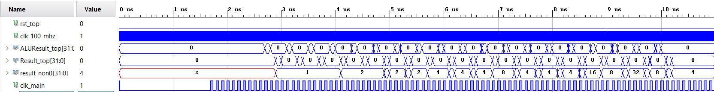
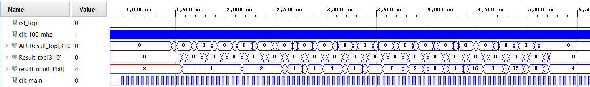
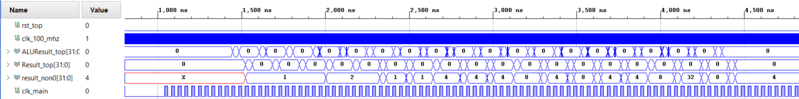

# MIPS Processor Timing
Written April 25, 2022 by Atticus Russell

### Note
Results shown were captured with Vivado's "Flatten Hierarchy" in default setting, but in re-structuring the project to be built via the tcl file, synthesis was only achievable with this setting set to "None". 

## Background
Setup time is the amount of time prior to the rising edge of the clock in which the inputs of a circuit must not change to avoid metastability. Hold time is the amount of time after the rising edge of the clock in which the inputs of a circuit must not change to avoid metastability. 

## Design Methodology
The pipelined MIPS processor developed in prior exercises was initialized with a clock frequency of 10 MHz and was implemented using Xilinx Vivado 2019.1. A timing analysis and post-implementation timing simulation were run, and the results of both were recorded. If the results indicated that neither setup or hold times were violated, the clock was incremented by five MHz and re-implemented. This process was repeated until timing-failure. 

## Results and Analysis
The highest clock frequency at which the processor was implemented and simulated successfully was 25 MHz. Waveforms from each of the successful post-implementation timing simulations in Xilinx Vivado are shown below in Figures [1](#figure-1-waveform-generated-by-post-implementation-timing-simulation-of-pipelined-mips-processor-at-10-mhz-in-vivado) through [4](#figure-4-waveform-generated-by-post-implementation-timing-simulation-of-pipelined-mips-processor-at-25-mhz-in-vivado).

#### Figure 1: *Waveform generated by post-implementation timing simulation of pipelined MIPS processor at 10 MHz in Vivado*

#### Figure 2: *Waveform generated by post-implementation timing simulation of pipelined MIPS processor at 15 MHz in Vivado*

#### Figure 3: *Waveform generated by post-implementation timing simulation of pipelined MIPS processor at 20 MHz in Vivado*

#### Figure 4: *Waveform generated by post-implementation timing simulation of pipelined MIPS processor at 25 MHz in Vivado*

The signals displayed in Figures [1](#figure-1-waveform-generated-by-post-implementation-timing-simulation-of-pipelined-mips-processor-at-10-mhz-in-vivado) through [4](#figure-4-waveform-generated-by-post-implementation-timing-simulation-of-pipelined-mips-processor-at-25-mhz-in-vivado) demonstrate that the behavior of the processor is consistent between each simulation despite the differing clock frequency. This is because all timing requirements were met for each of the simulations displayed. The results of the Vivado timing summary from each tested frequency are displayed in [Table 1](#table-1-information-from-post-implementation-timing-summary-of-created-mips-processor-in-xilinx-vivado-at-different-clock-frequencies).

#### Table 1: *Information from post-implementation timing summary of created MIPS processor in Xilinx Vivado at different clock frequencies*

| Frequency (MHz) | Worst Setup Slack (ns) | Worst Hold Slack (ns) | Timing Met |
| --- | --- | --- | --- |
| 10 | 44.638 | 0.059 | Yes |
| 15 | 23.499 | 0.075 | Yes |
| 20 | 8.117 | 0.058 | Yes |
| 25 | 1.139 | 0.050 | Yes |
| 30 | -0.793 | 0.048 | No |

[Table 1](#table-1-information-from-post-implementation-timing-summary-of-created-mips-processor-in-xilinx-vivado-at-different-clock-frequencies) shows how the setup slack decreased as the the frequency of the clock was increased, and how setup slack became negative when the clock was set to 30 MHz, which violated timing requirements and caused the implementation of the design to fail. Additionally, [Table 1](#table-1-information-from-post-implementation-timing-summary-of-created-mips-processor-in-xilinx-vivado-at-different-clock-frequencies) shows that (with the notable exception of at 15 MHz) the amount of hold slack also decreased as the clock frequency increased, but at a much slower rate than the setup slack. The hold slack was still at a positive value when the design failed to meet timing at 30 MHz, therefore it was not the cause of the timing violation.

## Conclusion
This exercise concluded the testing and simulation of the pipelined MIPS processor created in previous exercises, which was finally implemented. Setup and hold slack were both found to decrease as the clock frequency was increased, which is consistent with expected behavior. 
The implemented MIPS processor was not optimized, and likely could reach a higher clock speed after optimization, which could include a reduction of NOPs between certain instructions, a re-examination of the registers used for pipelining, and a restructuring of the multiplier component of the ALU. This exercise was successful, as the created pipelined MIPS processor successfully implemented and executed each MIPS instruction from the previously created Fibonacci program, and was capable of doing so across a range of clock frequencies. 
