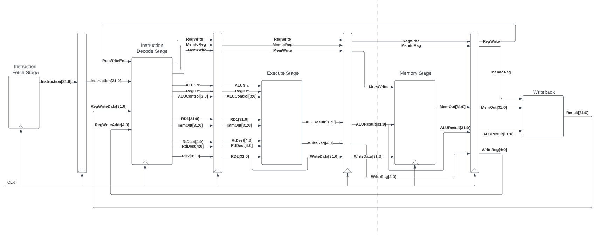
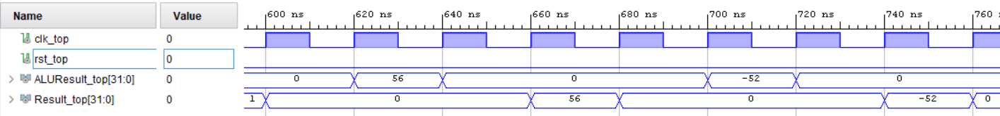
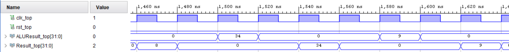
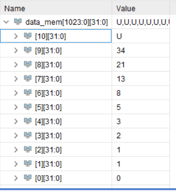

# Pipelined MIPS Processor
A pipelined MIPS microprocessor written in VHDL and simulated in Xilinx Vivado targeting Basys3 board. Simplified (incomplete) MIPS instruction set. Made in RIT DSD2 (CMPE-260). Synthesized and implemented, but never tested on hardware.

## Usage
This project was created using Xilinx Vivado 2019.1. Vivado was version controlled using [vivado-git](https://github.com/barbedo/vivado-git). 

To open as a Vivado project: 
- clone this repo
- cd to `vivado_project` and launch Vivado
- using `Tools -> Run Tcl Script...`, select the `clocked_MIPS.tcl` file in the directory this repo was cloned to. This will regenerate the Vivado project from the source files.

# Report : Pipelined MIPS Processor Simulation and Timing

Written April 2022 by Atticus Russell

## Abstract
The goal of this exercise was to tie together the five stages of the MIPS processor created using VHDL in prior exercises to create a functioning processor. The main code used clocked registers to connect each stage for pipelining. A program was created to verify the functionality of each of the instructions that were previously implemented in the MIPS stages using a self-checking testbench. The processor performed each of these instructions correctly. The processor was further tested by the development and execution of a program using MIPS instructions to compute the first 10 Fibonacci numbers and store them into Data Memory. Due to the lack of branch and jump instructions implemented in the processor, the algorithm developed to calculate the Fibonacci numbers was hard coded instead of recursive. Both the code developed to test each MIPS instruction, and the Fibonacci code displayed correct behavior when behaviorally simulated using Xilinx Vivado. 

Additionally, the design was synthesized and implemented in Vivado, and through incremental testing, was found to work at clock speeds up to 25MHz.

## Design Methodology
The complete 32-bit MIPS processor was created by connecting each of the MIPS stages created in prior exercises using clocked registers. A block diagram displaying the connections between the MIPS stages is shown in [Figure 1](#figure-1-block-diagram-of-connections-between-pipelined-mips-processor-stages)

#### Figure 1: *Block diagram of connections between pipelined MIPS processor stages*

[Figure 1](#figure-1-block-diagram-of-connections-between-pipelined-mips-processor-stages) displays the connections between the Instruction Fetch, Decode, Execute, Data Memory, and Writeback stages of the MIPS processor. The outputs of each of these stages are fed into an intermediary register prior to being loaded into the inputs of the following stage. For example, the instruction output by Instruction Fetch is fed into the first pipeline register when the clock signal goes high. The instruction remains in the register until the clock signal again goes high, at which time it is fed into the input of the Instruction Decode stage. Simultaneously, a new instruction is loaded into the intermediary register from the output of Instruction Fetch. This process is the same for the connections between all of the stages, with the exception of the outputs of the Writeback stage. As displayed in [Figure 1](#figure-1-block-diagram-of-connections-between-pipelined-mips-processor-stages), the outputs of the Writeback stage are fed asynchronously into the Instruction Decode stage. The operation of the Instruction Decode stage is dependent upon the output of the Writeback stage, from which it is separated by three clocked intermediary registers. Due to this, in order to avoid pipeline hazards, instructions are stored in Instruction Memory separated from one other by three NOPs

The completed pipelined MIPS processor has a clock and a reset input, and (in order to avoid components being optimized out of existence by Vivado) outputs the 32-bit ALUResult signal from the output of the Execute stage and the 32-bit Result signal from the output of the Writeback stage. The processor was tested using a program developed to test each of the implemented MIPS operations: ADD, ADDI, AND, ANDI, MULTU, OR, ORI, SLLV, SRLV, SRAV, SUB, XOR, XORI, SW, and LW. The instructions for this program were written in MIPS assembly and then translated into 32-bit MIPS machine code, which was initialized in the Instruction Memory with three NOPs between each instruction. A self-checking VHDL testbench was written to provide the clock and reset signals, and to to verify that the Result signal output by the Writeback stage for each instruction matched the predicted result through the use of assert statements.

The objective of this exercise was to calculate the first 10 Fibonacci numbers using the created MIPS processor, and to store the results of the calculations in Data Memory. The program was to be created using the specific subset of MIPS assembly instructions supported by this particular implementation of a MIPS processor. Traditionally, a recursive algorithm is used to compute Fibonacci numbers, however, because neither jump nor branch instructions were implemented on this processor, use of recursion in the MIPS program was not feasible. Therefore the MIPS program devised to compute the Fibonacci numbers simply uses addition.

The devised MIPS program accepts as inputs the first two Fibonacci numbers, which it sums to find the third Fibonacci number, which it stores. The second and third Fibonacci numbers are then summed to calculate the fourth, which is stored. This process repeats six additional times, summing the previous two Fibonacci numbers and storing the result, so that 10 total Fibonacci numbers, including the two provided, are known. Each calculated Fibonacci number is stored into Data Memory, starting at address 0, and the tenth calculated Fibonacci number stored at address 9. This algorithm is implemented through use of the MIPS assembly ORI instruction to load the first Fibonacci number into a specific register. It accepts the number as the immediate value of the instruction, and it is compared against R0, which always holds the value of zero in a MIPS processor (at least traditionally, and also in this program, but only because R0 is never written to after initialization to zero), and the result of the bitwise OR is stored in the specific register. The value of this register is then stored into address zero of Data Memory using the SW MIPS instruction with register R0 and an offset of zero. This process is repeated to load the second Fibonacci number into the next register and the next position in Data Memory (using SW with an offset of one). The sum of the first two Fibonacci numbers is computed using the ADD instruction, specifying the first two registers as addends and the next register as the destination for the sum. This sum is the third Fibonacci number, and it is stored in Data Memory at the third address using the SW instruction. This process is repeated seven additional times, so that all of the first 10 Fibonacci numbers are stored in Data Memory, and then the program ends. 

A VHDL testbench was created to provide clock and reset signals to the MIPS processor. The Fibonacci program was behaviorally simulated, and the contents of Data Memory at the end of the program were inspected to determine the output of the Fibonacci program. 

### Timing
Setup time is the amount of time prior to the rising edge of the clock in which the inputs of a circuit must not change to avoid metastability. Hold time is the amount of time after the rising edge of the clock in which the inputs of a circuit must not change to avoid metastability. 

The pipelined MIPS processor was initialized with a clock frequency of 10 MHz and was implemented using Xilinx Vivado 2019.1. A timing analysis and post-implementation timing simulation were run, and the results of both were recorded. If the results indicated that neither setup or hold times were violated, the clock was incremented by five MHz and re-implemented. This process was repeated until timing-failure. 

## Results and Analysis
The aforementioned pipelined MIPS processor created in VHDL was behaviorally simulated with Xilinx Vivado using the created self-checking VHDL testbench and the machine code created to test each MIPS instruction loaded into Instruction Memory. The waveform generated by this behavioral simulation is shown in [Figure 2](#figure-2-selected-section-of-waveform-generated-by-behavioral-simulation-of-pipelined-mips-processor-running-test-instructions-in-vivado).

#### Figure 2: *Selected section of waveform generated by behavioral simulation of pipelined MIPS processor running test instructions in Vivado*

The ALUResult and Result signals in [Figure 2](#figure-2-selected-section-of-waveform-generated-by-behavioral-simulation-of-pipelined-mips-processor-running-test-instructions-in-vivado) (shown in signed decimal format) display the results from execution of test instructions. The Result signal is offset from the ALUResult signal by two clock periods because there are two clocked intermediary registers for pipelining between the output of the Execute stage, which is the origin of the ALUResult signal, and the output of the Writeback stage, which is the origin of the Result signal. These two registers, the first of which separates the Execute and Data Memory stages, and the second separates the Data Memory and Writeback stages, are shown in [Figure 1](#figure-1-block-diagram-of-connections-between-pipelined-mips-processor-stages). 

The first nonzero value of ALUResult pictured in [Figure 2](#figure-2-selected-section-of-waveform-generated-by-behavioral-simulation-of-pipelined-mips-processor-running-test-instructions-in-vivado) was produced by using the SLLV instruction to logically shift a value of seven left by three places. This effectively calculates $7 \cdot 2^3 = 56 $, which is output by the ALU and passed through the two intermediary registers to the following stages, as shown by the value of Result. The 60 ns period in [Figure 2](#figure-2-selected-section-of-waveform-generated-by-behavioral-simulation-of-pipelined-mips-processor-running-test-instructions-in-vivado) where the value of ALUResult is zero is caused by the three NOPs used for pipelining that separate each of the instructions in Instruction Memory. The second nonzero value of ALUResult pictured in [Figure 2](#figure-2-selected-section-of-waveform-generated-by-behavioral-simulation-of-pipelined-mips-processor-running-test-instructions-in-vivado) was produced by using the SUB instruction to subtract the previous result, 56, from a value of four. As displayed, this equals -52. Therefore, the results of the two pictured MIPS instructions were correctly calculated. Additionally, all other implemented MIPS instructions were tested and found to produce the correct results.

The execution of the aforementioned MIPS program developed to calculate the first 10 numbers of a Fibonacci sequence using the pipelined MIPS processor was behaviorally simulated using Xilinx Vivado. The calculation and storage of the tenth Fibonacci number in this sequence is shown in [Figure 3](#figure-3-selected-section-of-waveform-generated-by-behavioral-simulation-of-pipelined-mips-processor-running-fibonacci-program-in-vivado). 

#### Figure 3: *Selected section of waveform generated by behavioral simulation of pipelined MIPS processor running Fibonacci program in Vivado*

The value calculated by the MIPS program for the tenth number in a Fibonacci sequence with starting terms of 0 and 1, is displayed in [Figure 3](#figure-3-selected-section-of-waveform-generated-by-behavioral-simulation-of-pipelined-mips-processor-running-fibonacci-program-in-vivado) (in decimal form) as 34. It is displayed in the signal ALUResult in the period from 1500 to 1520 ns, when the ALU outputs the result of the ADD instruction which used the previous two Fibonacci numbers as operands. As shown in [Table 1](#table-1-contents-of-data-memory-after-execution-of-mips-program-to-find-first-ten-fibonacci-numbers), the values of the eighth and ninth Fibonacci numbers were 13 and 21. Therefore, the program calculated the tenth number in the Fibonacci series correctly. The second nonzero value of ALUResult shown in [Figure 3](#figure-3-selected-section-of-waveform-generated-by-behavioral-simulation-of-pipelined-mips-processor-running-fibonacci-program-in-vivado) is nine. The ALU outputs this value as the result of the SW instruction that specifies the value from a specified register (which in this case contains the tenth Fibonacci number) be stored in Data Memory at the index equal to the sum of the value in register R0 and an immediate value of nine. The sum of R0 and nine is nine, which is output by the ALU.

#### Table 1: *Contents of Data Memory after execution of MIPS program to find first ten Fibonacci numbers*

The full sequence of ten Fibonacci numbers calculated by the MIPS program are displayed in [Table 1](#table-1-contents-of-data-memory-after-execution-of-mips-program-to-find-first-ten-fibonacci-numbers). These correctly match the values of the first ten numbers in the Fibonacci sequence. Therefore, the MIPS program written to calculate them functioned correctly, and the pipelined MIPS processor functioned as intended. 

### Timing
##### Note: Timing results shown were captured with Vivado's "Flatten Hierarchy" in default setting, but in re-structuring the project to be built via the tcl file, synthesis was only achievable with this setting set to "None". 

The highest clock frequency at which the processor was implemented and simulated successfully was 25 MHz. Waveforms from each of the successful post-implementation timing simulations in Xilinx Vivado are shown below in Figures [4](#figure-4-waveform-generated-by-post-implementation-timing-simulation-of-pipelined-mips-processor-at-10-mhz-in-vivado) through [7](#figure-7-waveform-generated-by-post-implementation-timing-simulation-of-pipelined-mips-processor-at-25-mhz-in-vivado).

#### Figure 4: *Waveform generated by post-implementation timing simulation of pipelined MIPS processor at 10 MHz in Vivado*

#### Figure 5: *Waveform generated by post-implementation timing simulation of pipelined MIPS processor at 15 MHz in Vivado*

#### Figure 6: *Waveform generated by post-implementation timing simulation of pipelined MIPS processor at 20 MHz in Vivado*

#### Figure 7: *Waveform generated by post-implementation timing simulation of pipelined MIPS processor at 25 MHz in Vivado*

The signals displayed in Figures [4](#figure-4-waveform-generated-by-post-implementation-timing-simulation-of-pipelined-mips-processor-at-10-mhz-in-vivado) through [7](#figure-7-waveform-generated-by-post-implementation-timing-simulation-of-pipelined-mips-processor-at-25-mhz-in-vivado) demonstrate that the behavior of the processor is consistent between each simulation despite the differing clock frequency. This is because all timing requirements were met for each of the simulations displayed. The results of the Vivado timing summary from each tested frequency are displayed in [Table 2](#table-2-information-from-post-implementation-timing-summary-of-created-mips-processor-in-xilinx-vivado-at-different-clock-frequencies).

#### Table 2: *Information from post-implementation timing summary of created MIPS processor in Xilinx Vivado at different clock frequencies*

| Frequency (MHz) | Worst Setup Slack (ns) | Worst Hold Slack (ns) | Timing Met |
| --- | --- | --- | --- |
| 10 | 44.638 | 0.059 | Yes |
| 15 | 23.499 | 0.075 | Yes |
| 20 | 8.117 | 0.058 | Yes |
| 25 | 1.139 | 0.050 | Yes |
| 30 | -0.793 | 0.048 | No |

[Table 2](#table-2-information-from-post-implementation-timing-summary-of-created-mips-processor-in-xilinx-vivado-at-different-clock-frequencies) shows how the setup slack decreased as the the frequency of the clock was increased, and how setup slack became negative when the clock was set to 30 MHz, which violated timing requirements and caused the implementation of the design to fail. Additionally, [Table 2](#table-2-information-from-post-implementation-timing-summary-of-created-mips-processor-in-xilinx-vivado-at-different-clock-frequencies) shows that (with the notable exception of at 15 MHz) the amount of hold slack also decreased as the clock frequency increased, but at a much slower rate than the setup slack. The hold slack was still at a positive value when the design failed to meet timing at 30 MHz, therefore it was not the cause of the timing violation.

## Conclusion
This exercise expanded upon the creation and simulation of the pipelined MIPS processor components created in previous exercises. The processor assembled in this exercise will be further optimized in the final exercise. Additionally, the process of writing the program in this exercise to find the 10 first values of the Fibonacci sequence showed how critical logic to execute jump and branch instructions is, as without them recursion and loops are not possible. The created pipelined MIPS processor successfully executed each implemented MIPS instruction, and successfully found the first ten numbers of the Fibonacci sequence. 

The MIPS processor was additionally synthesized and implemented. Setup and hold slack were both found to decrease as the clock frequency was increased, which is consistent with expected behavior. 
The implemented MIPS processor was not optimized, and likely could reach a higher clock speed after optimization, which could include a reduction of NOPs between certain instructions, a re-examination of the registers used for pipelining, and a restructuring of the multiplier component of the ALU. This exercise was successful, as the created pipelined MIPS processor successfully implemented and executed each MIPS instruction from the created Fibonacci program and found the first ten numbers of the Fibonacci sequence across a range of clock frequencies. 
